  
  <h1>Karol Marcela Cotame Garcés</h1>
  
Estudiante de Ingeniería de Sistemas | Desarrollo de Software | Ciberseguridad

  
<strong>Desarrollo de Software:</strong> Una disciplina clave en la ingeniería de sistemas que permite crear, diseñar y mantener aplicaciones y sistemas informáticos. Es un área en constante evolución que combina creatividad y lógica para resolver problemas del mundo real.

---

# 💫 About Me:
🔭 Actualmente trabajando en proyectos personales y profesionales. 
🤝 Buscando colaborar en proyectos interesantes. 
🌱 Aprendiendo sobre desarrollo de software, estructuras de datos y lenguajes de programación. 
📫 Contáctame: karolmarcelacotame@gmail.com

---

## 📊 Mis Hobbies:

```mermaid
graph TD;
  A[Hobbies] --> B[Leer];
  A --> C[Escuchar Música];
  A --> D[Terror];
  A --> E[Ver Series];
  A --> F[Comer Pasta];
```

Puedes editar esta gráfica para reflejar mejor tus intereses cambiando los nodos y conexiones.

---

## 🌐 Socials:

---

## 💻 Tech Stack:
 
 
 

---

## 📊 GitHub Stats:
 
 

---

